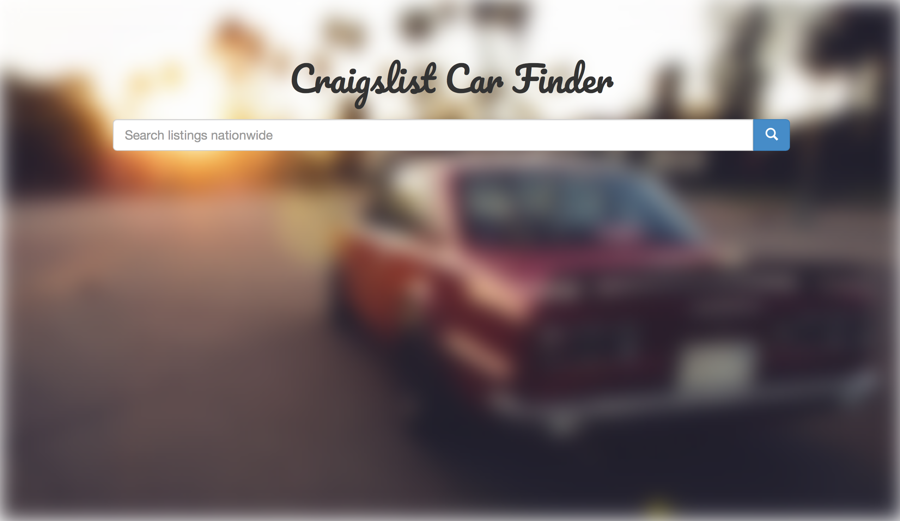
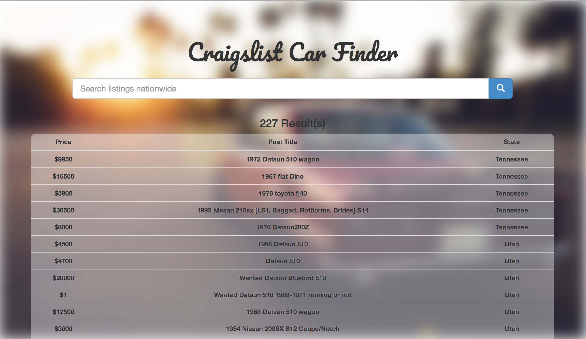

# craigslist-car-finder

> web app to gather nation-wide car listings

Check out the intro I wrote on web scraping [here](https://owen-brooks.github.io/maven/java/build/2018/08/15/web-scraping.html).

## Purpose

For people who like weird / rare cars, Craigslist is a great resource. Unlike other items sold on Craigslist, a car buyer will often be willing and sometimes have no choice but to search nationwide for the right car. This application allows users to search across all US Craigslist pages, for the car they are looking to buy.



## Features

Currently a search collects the following data from a post:

- Posting ID
- Price
- Post title
- State
- Link to post

For example - a search for "Datsun 510 will return the following:



Each row is clickable and will open the Craiglist in another tab.

## Code

**Overview of file structure:**

```
|___ app
    |___ static
    |___ templates
    |___ __init__.py
    |___ controller.py
|___ scraper
|___ run.py
|___ app.yaml
|___ docs
```

## TODO / Notes

- Deploy to Google Cloud. Has all the files just need to create app and collect requirements
- Collect additional data (transmission type, fuel, title, etc.)
- Try to present cars as images. This can be tough to scale - it seems the sites for different regions label there images in HTML differently
